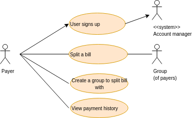
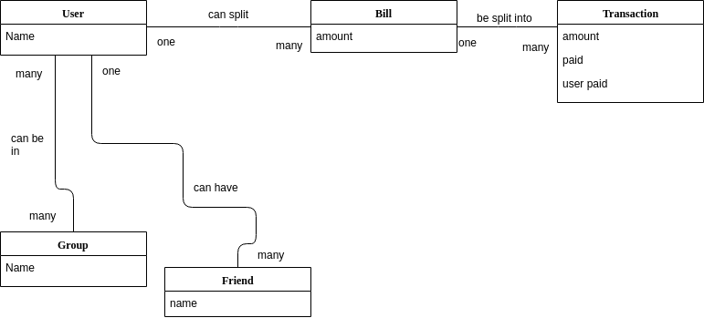

# Requirements

## User Stereotypes
College students and early to mid 20 year olds who go out with friends or live with roommates. 

Alison, Bob, and Claire are going out for brunch. They decide to take an uber and tell each other that they will pay back whoever pays for the uber. At brunch, they order the same amount of food and decide to split the bill. But then Claire orders bottomless mimosas but Alice and Bob don’t want to drink. Now they have to decide how to split the bill but account for Claire ordering drinks. They use Oink to weigh the amount that Claire should pay and then split the bill three ways. They can also use Oink to keep track of who pays for Ubers.
 
David and Escobar live together. Each month they have to split their utility bills. However, in July, Escobar leaves the AC running but it’s only felt in his room so David is left to suffer in the heat. When their electric bill for July arrives, Escobar needs to pay extra to cover the cost of running the AC. They can use Oink to figure out how much each roommate pays. 

Fred and George decide to travel for spring break to different countries. They are sharing hotel rooms and decide to alternate who will pay for each one. They can use Oink to keep track of how much each person has paid and make sure no one person is paying more than the other. 

## Use Cases

1.
        Title: Split a bill
        Actor: Payer 
        Scenario: Payer logs in. Payer enter the amount of the bill. Payer chooses other users to split or payer can choose to split with a group of people. If the Payer want to split unevenly, the Payer can choose weights. The system then sends notifications to all selected users notifying them of the bill payment. 

2.
        Title: Create a group
        Actor: Payer
        Scenario:Payer logs in. Payer selects to create a new split group. The Payer enters the names of the other users that will be in the group. Payer creates a name for the group. System saves the group for the Payer

3.
        Title: Sign up
        Actor: Payer
        Scenario: Payer navigates to main page. Payer decides to sign up with Oink. Payer enters information such as username, password, email, etc. System saves information to database. When Payer goes to log in, they enter email/username and password.

4.
        Title: View Payment History
        Actor: Payer
        Scenario: Payer wants to see all payments made by date/person/type/amount. The Payer navigates to the page to see all transactions and bill splits with their chosen criteria. The system queries the database to find all necessary transactions. The system returns the results and are shown to the Payer.

All 4 of these diagrams are visually explained in the following UML diagram:

## Domain Model

## Stakeholder Interviews
Features to think about: 
* If a bill has a tip, that also needs to be split

This project would be best as a mobile app and an IOU feature would good. If we have time with the project, we should try to add payment information with a sanbox account or some way to create a fake account.

This app can also be used for situations such as tracking money on a laundry card, groceries, apartment essentials, or furniture costs. 

## Functional Requirements
The system will let a user create an account and then log in. The system will let the user add friends, and add groups of friends, to their profile. The system will allow the user to split a new bill and create a new transaction for each person that bill is being split with. The system will track how much each user has paid and any trends between friends. The system will allow the user to see their payment history. All the information will be stored in the database for the system.

We will use the MERN stack but with MySQL instead of Mongodb. We can use the NYU cims servers for a database server and deploy the app to Heroku.

## Non-functional Requirements
We may have to cut back on features if we run into any blocks with our system but that will be addressed as the project goes on and we can see our progress. We don't have the power to be able to make this project "scalable" and if we are able to implement a payment system, there are limitations with authorization, security, etc. This project should be able to port to different browers, and possibly different phones models as well.
